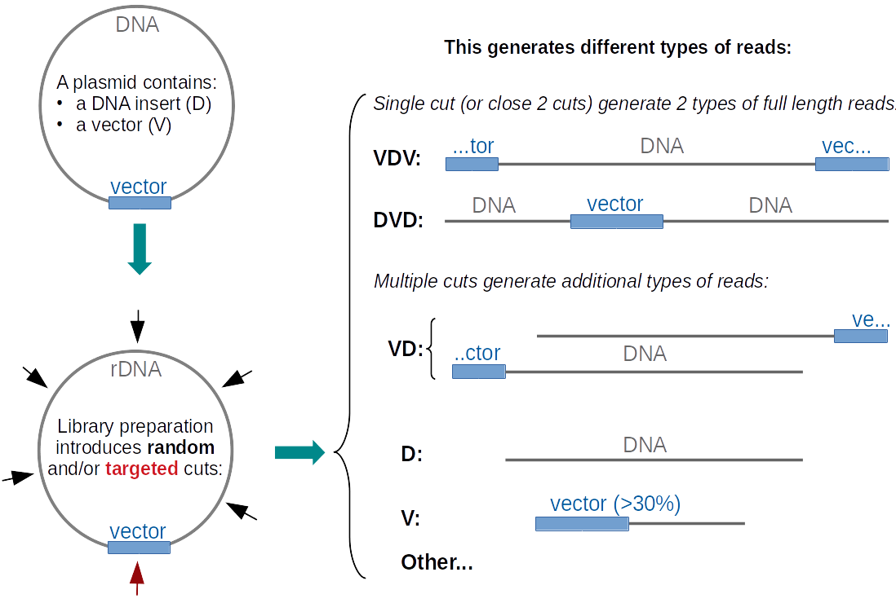

# NanoBAC_pipeline

## Description of the pipeline

This snakemake pipeline is designed to generate a consensus sequence from Nanopore reads (or other long read technology) obtained from plasmids/BAC/YAC.  
There are currently 2 approaches to generate Nanopore reads from plasmid DNA:  

  - The *"rapid kit"* relies on a random fragmentation of the plasmid with concommitant incorporation of barcodes using MuA transposase
  - The *"ligation protocol"* involves cutting the plasmid and ligating barcodes/adapters
  
These 2 approaches can generate different types of reads characterized by the relative organization of insert DNA and vector sequence in the reads:  




The NanoBAC pipeline uses *multiple alignment of VDV reads* to generate a first consensus sequence and then uses DVD reads (after splitting at the vector) and long VD reads to polish the consensus sequence.

Sequencing such large plasmids with long read technology is generally used to assemble highly repetitive regions of the genome. Thus, there are often know sequences (named "GeneA" and "GeneB" in the pipeline) that are expected in such sequences. The pipeline takes advantage of such sequences to filter the reads.  
Nanopore reads from plasmid sequencing are often contaminated with fragments of the host (e.g. E. Coli) genome, especially when using a *ligation proocol* where the fragment ends of the fragmentated host genome compete for adapter ligation. Such reads are also identified and filtered by the pipeline.  


### Inputs:
The pipeline takes as inputs:

  - One or several **fastq** file containing the **Nanopore reads** obtained for each plasmid (e.g. `BAC01.fastq` and `BAC02.fastq`)
  - a **fasta** file containing the **host genome** (possibly previously masked in regions homologous to the vector sequence or to expected sequences such as GeneA and GeneB)  
  - a **fasta** file containing the **vector** sequence (i.e. the plasmid used to clone the DNA insert)  
  - a **fasta** file containing the sequence of **GeneA** (= a sequence that is expected in the insert DNA)  
  - a **fasta** file containing the sequence of **GeneB** (= a sequence that is expected in the insert DNA)  
  
*Note: The vector sequence should be provided with the full restricton site that was used to clone the insert at both the beginning and the end of the vector sequence*


### What does the pipeline do?

The pipeline will do the following:

  - Rename the reads (to simplify their very long names) and save a table of the old names and new names
  - Obtain a table of the read length
  - Align the vector, GeneA and GeneB on the reads using Blast
  - Align the reads on the host genome using minimap2
  - Based on all the above data, classify the reads in particular in terms of VDV, DVD, VD...
  - Select VDV reads of the appropriate size and replace the vector sequence by the full true vector sequence at both ends of VDV reads
  - Perform multiple alignment on several random samples of VDV reads, obtain the consensus sequence from each multiple alignment and perform a multiple alignment of these consensus to obtain the initial consensus sequence.
  - Select DVD reads, split them at the vector sequence (to get DV or VD reads) and orient them in a consistent manner.
  - Select long VD reads and combine them with split DVD reads.
  - Use these VD/DV reads to polish twice the initial consensus sequence
  
This will give the final assembly which is found in `assembly/final_assembly_BACname.fa`

### Outputs:
The pipeline creates the folders and files illustrated below. 
Apart from the files linked to the snakemake pipeline itself here is the typical output for the analysis of `BACproject/data/raw/BAC01.fastq`:
```
BACproject
├── align
│   ├── Blast
│   │   ├── db
│   │   │   ├── BAC01_blastdb.nhr
│   │   │   ├── BAC01_blastdb.nin
│   │   │   ├── BAC01_blastdb.nog
│   │   │   ├── BAC01_blastdb.nsd
│   │   │   ├── BAC01_blastdb.nsi
│   │   │   └── BAC01_blastdb.nsq
│   │   └── results
│   │       ├── BAC01_geneAblast.res
│   │       ├── BAC01_geneBblast.res
│   │       └── BAC01_vectorblast.res
│   ├── kalign
│   │   ├── ConsFromVDV
│   │   │   └── BAC01_consAlign.msf
│   │   └── VDVrndSets
│   │       ├── BAC01_RS1_cons.fa
│   │       ├── BAC01_RS1.msf
│   │       ├── BAC01_RS2_cons.fa
│   │       └── BAC01_RS2.msf
│   └── minimap2
│       ├── host
│       │   ├── BAC01_alignment.stats
│       │   └── BAC01.paf
│       ├── polishing_InitialConsensus
│       │   └── BAC01.paf
│       └── polishing_Polished01
│           └── BAC01.paf
├── assembly
│   ├── BAC01_InitialConsensus.fa
│   ├── BAC01_Polished01.fa
│   └── final_assembly_BAC01.fa
├── data
│   ├── raw
│   │   └── BAC01.fastq
│   └── renamed
│       ├── BAC01.fa
│       └── BAC01.fq.gz
├── log
├── Plots
│   └── BAC01_VDVreadSelection.png
├── SelectedReads
│   ├── BAC01_VDreadsForPolishing.fa
│   ├── DVD
│   │   ├── BAC01_SelSplit_DVD.fa
│   │   ├── BAC01_SelSplit_DVD.rds
│   │   └── BAC01_SelSplit_DVD_ReadNames.tsv
│   ├── longVD
│   │   ├── BAC01_Sel_longVD.fa
│   │   ├── BAC01_Sel_longVD.fq.gz
│   │   ├── BAC01_Sel_longVD.rds
│   │   └── BAC01_Sel_longVD_ReadNames.tsv
│   ├── VDV
│   │   ├── BAC01_Sel_VDV.fa
│   │   ├── BAC01_Sel_VDV.fq.gz
│   │   ├── BAC01_Sel_VDV.rds
│   │   └── BAC01_Sel_VDV_ReadNames.tsv
│   └── VDVprepared
│       ├── BAC01_SelectedPreparedVDVreads.fa
│       ├── BAC67_VDVreads_InsertVectorJunctions.rds
│       └── RandomSamples
│           ├── BAC01_RS1.fa
│           └── BAC01_RS2.fa
└── tables
    ├── ReadClass
    │   └── BAC01_ReadClass.rds
    ├── ReadLength
    │   └── BAC01_ReadLength.tsv
    └── ReadNames
        └── BAC01_ReadNameTable.tsv
```


## Softwares needed to run the pipeline  

Running the NanoBAC pipeline requires the following softwares (tested with the version indicated, the pipeline should also work with more recent versions as long as they are backward compatible):  

  - [snakemake](https://snakemake.readthedocs.io/en/stable/) (5.4)
  - [blast](https://www.ncbi.nlm.nih.gov/books/NBK279690/) (2.9.0)
  - [kalign2](https://msa.sbc.su.se/cgi-bin/msa.cgi) (2.04)
  - [minimap2](https://github.com/lh3/minimap2) (2.17)
  - [python](https://www.python.org/) (3.6.10)
  - [samtools](http://www.htslib.org/) (1.9)
  - [seqtk](https://github.com/lh3/seqtk) (1.3)
  - [racon](https://github.com/isovic/racon) (1.4.13)
  - [R](https://www.r-project.org/) (3.6)

In addition, the [NanoBAC R package](https://github.com/pgpmartin/NanoBAC) and its dependencies should be installed, as well as the [R.utils](https://cran.r-project.org/web/packages/R.utils) package. However, installing R and the NanoBAC R package is optional if you use [Singularity](https://sylabs.io/docs/), as explained below. In this latter case, you will also need:

  - [Singularity](https://sylabs.io/docs/) (3.5.2)


### Option 1: install everything yourself

You can manually install all these tools and make sure they are accessible via your `$PATH`.  
When using a cluster (using `snakemake --cluster` as explained below), many of these tools may already be accessible via [environment modules](http://modules.sourceforge.net/). In order to use them, you need to install snakemake version >5.9.0 and to modify the `SnakeFile` to adapt it to your own system/environment: see the commented lines starting by `envmodules:` and see the [documentation](https://snakemake.readthedocs.io/en/stable/snakefiles/deployment.html#using-environment-modules). The lines are commented in order for the pipeline to also work with earlier versions of snakemake.


### Option 2: install R/NanoBAC and let conda do the rest

All the pipeline steps involving R/NanoBAC are fairly fast and are thus run locally (i.e. not submitted to a cluster when using `snakemake --cluster` as explained below). Note that you can change this behavior by editing the line starting by `localrules: all,...` at the top of the `Snakefile`.  
If you already have R installed, or prefer to install it by yourself, make sure R (v>3.6) is in your PATH (e.g. `echo $PATH` or `which R`).  

Then start R and install the NanoBAC package using:
```r
devtools::install_github("pgpmartin/NanoBAC")
```

Install the `R.utils` package with:
```r
install.packages("R.utils")
```
  
  
The easiest way to install all the other tools at once is to use [conda](https://conda.io/en/latest/index.html) with the [bioconda channel](https://bioconda.github.io/).  
After installing conda (see for example [miniconda](https://conda.io/en/latest/miniconda.html)), you can use the [NanoBAC.yml](https://github.com/pgpmartin/NanoBAC_pipeline/blob/master/NanoBAC.yaml) file to create an environment containing all the tools needed for the pipeline.

Create the NanoBAC conda environment:  
```bash
conda env create -f NanoBAC.yml
```

Activate the environment using
```bash
source activate NanoBAC
```

  
### Option 3: just install snakemake, conda and Singularity

It is also possible to let the pipeline install and use the right tools for each task. To do this, it is only necessary to have snakemake, conda and [Singularity](https://sylabs.io/guides/3.5/user-guide/index.html) installed.

In this case, the pipeline must be run with the arguments:  
```bash
snakemake --use-singularity --use-conda
```

It is also a good idea to create a folder (say `myenvs/`) where the conda environments for each software will be built when the pipeline is run for the first time. In this way, if the pipeline is run in different folders, it is possible to reuse previously installed environments using:
```bash
snakemake --use-singularity --use-conda --conda-prefix=path/to/myenvs
```

If you choose this option her is what will happen:  

  - A singularity container ([pgpmartin/SingIMG:r36_nanobac](https://singularity-hub.org/collections/4415)) will be downloaded and activated. It contains R v3.6.2 with all the packages needed to run the pipeline (including the [NanoBAC package](https://github.com/pgpmartin/NanoBAC)). This container will be used for all tasks using R. If you already have R installed on your system, make sure this doesn't conflict with your current R version, especially if you modified the file `~/.Renviron` to specify a specific folder for your packages.
  - Small conda environments will be built (in `myenvs/` if you followed the steps above) with the different softwares needed (e.g. blast, samtools, etc.) and will be used in the corresponding tasks of the pipeline.

  
  
## Organization of the folder

### Project folder
Create a project folder, for example:
```bash
projPath="/DATA/BACproject"
mkdir -p ${projPath}
cd ${projPath}
```

### Folder to build the conda environments
Create a folder in which the conda environments will be built:  
```bash
mkdir -p ${projPath}/myenvs
```
Note that this folder could be placed in another location if you want to run the pipeline in different project folders using these same environments.


### data folder
Create the subdirectory `data/raw/`  
```bash
mkdir -p ${projPath}/data/raw
```
In the `data/raw/` subdirectory, place the fastq file(s) with your Nanopore reads for your BAC(s) sequencing experiment (format must be: `sampleName.fastq` where `sampleName` is replaced by the actual name(s) of your sample(s))  


### Pipeline files and folders
In the `projPath` directory, place the following files:  

  - `Snakefile`  
  - `config.json` *(edit to your need)*  
  - `cluster.json`  
  - `envs/` folder with all its content (`*.yaml` files)  
  - `scripts/` folder with all its content (`*.R` and `*.sh` files)
  
Note that the `scripts` folder, like the `myenvs` folder above, could be used to run the same pipeline for different projects. Thus, it can be placed in a different location. If you do this, make sure that you edit the `config.json` file to indicate the location of this script folder (`scriptDIR`) 

All these files can be obtained by cloning the [NanoBAC_pipeline](https://github.com/pgpmartin/NanoBAC_pipeline) using:
```bash
git clone https://github.com/pgpmartin/NanoBAC_pipeline.git
```

Your folder should look something like this:
```
BACproject
├── cluster.json
├── config.json
├── data
│   └── raw
│       ├── BAC01.fastq
│       ├── BAC02.fastq
│       └── BAC03.fastq
├── envs
│   ├── blast.yaml
│   ├── kalign2.yaml
│   ├── minimap2.yaml
│   ├── racon.yaml
│   ├── samtools.yaml
│   └── seqtk.yaml
├── log
├── myenvs
├── scripts
│   ├── AnnotateBACreads_args.R
│   ├── getNanoBACconsensus.R
│   ├── MakeRandomSamplesFromFasta.sh
│   ├── prepareVDVreads_args.R
│   ├── selectlongVDreads_args.R
│   ├── selectSplitDVDreads_args.R
│   └── selectVDVreads_args.R
└── Snakefile
```

Make sure the scripts are executable with `chmod u+x ${projPath}/scripts/*` (same for the SnakeFile)


## Running the pipeline  

### Run locally

Activate your conda environment and make sure R is in your path with the NanoBAC package installed:
```bash
source activate NanoBAC
which R #check that R is installed (and have the NanoBAC R package installed too)
```

Run locally using 4 threads:
```bash
snakemake -j 4
```

If you just have snakemake, conda and R/NanoBAC installed but not the other softwares, you can run locally (still using 4 threads with `-j 4`) and building the small conda environments with each software in `${projPath}/myenvs` using:
```bash
snakemake \
  -j 4 \
  --use-conda \
  --conda-prefix ${projPath}/myenvs
```

If you don't have R and the R NanoBAC package installed, you can also run locally using the singularity image (make sure Singularity is installed):
```bash
snakemake \
  -j 4 \
  --use-singularity \
  --use-conda \
  --conda-prefix ${projPath}/myenvs
```

By default the singularity image will only have access to your current folder. If the files that you are using for the pipeline (e.g. the vector sequence, the sequences for GeneA and GeneB and/or the sequence of the host genome) are located in another folder, you must make sure that singularity can access these files too.  
For example, if your files are located in a folder called `~/Bank`:
```bash
snakemake \
  -j 4 \
  --use-singularity \
  --singularity-args "--bind ~/Bank" \
  --use-conda \
  --conda-prefix ${projPath}/myenvs
```

If they are located in different folders, use: `--singularity-args "--bind ~/FolderA,~/FolderB"`  
  
  

### Run Interactively on a cluster

The commands above (and in the next paragraph below) can be used while logged in interactively on a cluster node.  
For example in **PBS/Torque**, you would use something like:
```bash
qsub -I -q interactive -l nodes=1:ppn=4,walltime=8:00:00,mem=12G,vmem=12G
```
This would give you 4 cores on a single node and 8h to run the pipeline with the commands above (after making sure snakemake + conda + R or singularity are available)

Using **slurm**, an equivalent command would be:
```bash
sinteractive --ntasks=1 --cpus-per-task=4 --mem=12G --time=08:00:00
# or
srun -p general -N 1 --ntasks-per-node=4 --mem=12G --time=08:00:00 --pty bash
```


### Run on a cluster

Whether logged in interactively on a cluster node or not, it is possible (and a good idea) to submit the tasks of the pipeline requiring more resources and time to a cluster via the job submission and scheduling system. The default and task-specific submission parameters are defined in the file `cluster.json`. These are then passed to the scheduler-specific submission command via the `--cluster` argument as illustrated below for PBS and SLURM.

Run on a cluster using **PBS/Torque** scheduler:
```bash
snakemake \
  -j 100 \
  --use-conda \
  --conda-prefix ${projPath}/myenvs \
  --cluster-config cluster.json \
  --cluster "qsub -l nodes=1:ppn={threads},walltime={cluster.time},mem={cluster.mem},vmem={cluster.mem} -o {cluster.logfolder} -e {cluster.logfolder}"
```
*Note that here, the `-j` argument indicates the maximum number of jobs submitted to the cluster, not the number of threads.*


Run on a cluster using **SLURM** scheduler (and using singularity):
```bash
snakemake \
  -j 100 \
  --use-conda \
  --use-singularity \
  --singularity-args "--bind ~/Bank" \
  --conda-prefix ${projPath}/myenvs \
  --cluster-config cluster.json \
  --cluster "sbatch -o {cluster.logfolder} -e {cluster.logfolder} --mem-per-cpu={cluster.mem} --time={cluster.time} --ntasks=1 --cpus-per-task={threads}"
```

If running Snakemake in an interactive session and submitting batch jobs, it may be necessary to add the option `--latency-wait 120 all` as explained [here](https://hpc.nih.gov/apps/snakemake.html).
